# 零基础 GitHub 免费搭建博客

本手册基于 Windows 系统演示。介绍的免费博客，用到的最重要的两个工具是全球最大的代码托管平台 GitHub 和快速、简洁且高效的博客框架 Hexo。编辑器推荐使用 Visual Studio Code。

## 注册 GitHub 账号

首先你需要有一个 GitHub 账号，注册账号很简单，不做详细介绍。GitHub 官网：https://github.com/

## 安装 Visual Studio Code

下载安装 Visual Studio Code：https://code.visualstudio.com/ 。安装过程简单，一路默认安装完成即可。

## 安装 git

下载 git：https://git-scm.com/ 。

下载完后，双击安装，选择安装目录：

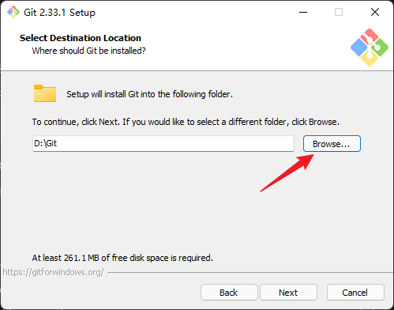

然后一路默认下一步，直到安装完成。

按快捷键 `WIN + S`，搜索 `环境变量`：

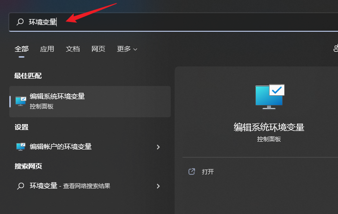

打开 `编辑系统环境变量`，点击 `环境变量`，接着 `系统变量` 下选择 `Path`，点击 `编辑`，接着点击 `新建`，将 git 安装路径下的两个路径分别加进去，最后确定：

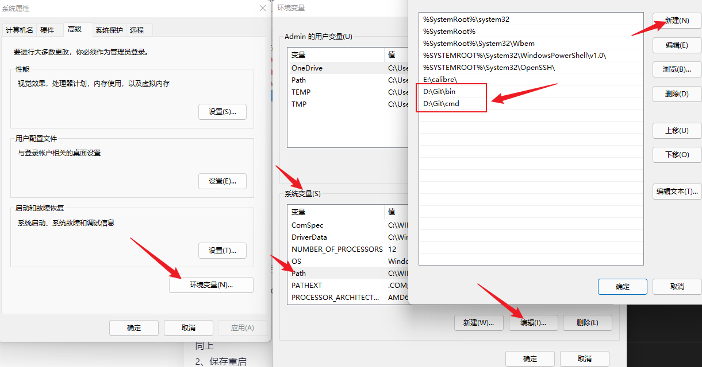

打开 Visual Studio Code，新建终端，输入 `git` 回车，查看是否安装成功（显示如下图信息就是安装成功）：

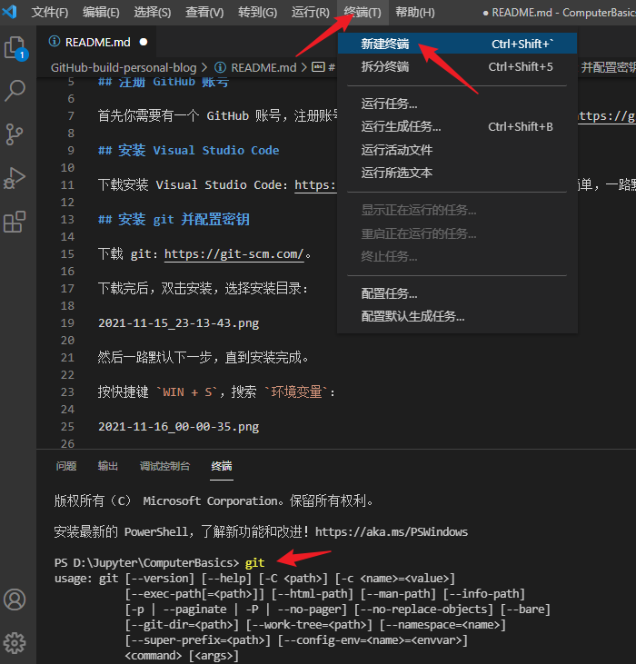

##  配置 git 密钥和账号

Visual Studio Code 终端继续输入命令 `ssh-keygen -t rsa -C "邮件地址"`（这里的 `邮件地址` 是注册 GitHub 账号时用的邮件地），连敲三次回车，生成 ssh key 址：

记事本打开生成的密钥文件 `id_rsa.pub`，复制其中的全部内容：

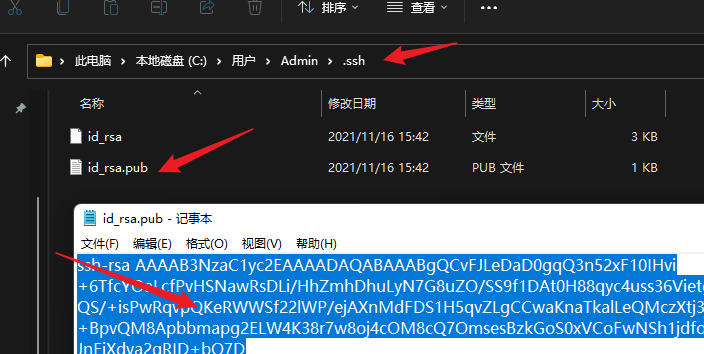

登录 GitHub，按照下图指示新增 SSH key：

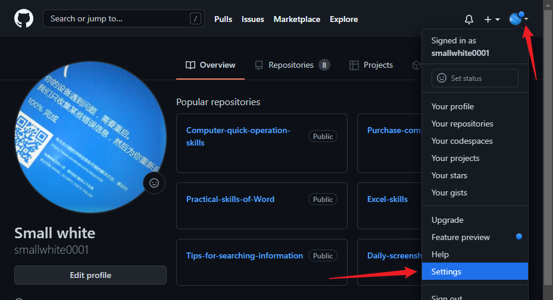

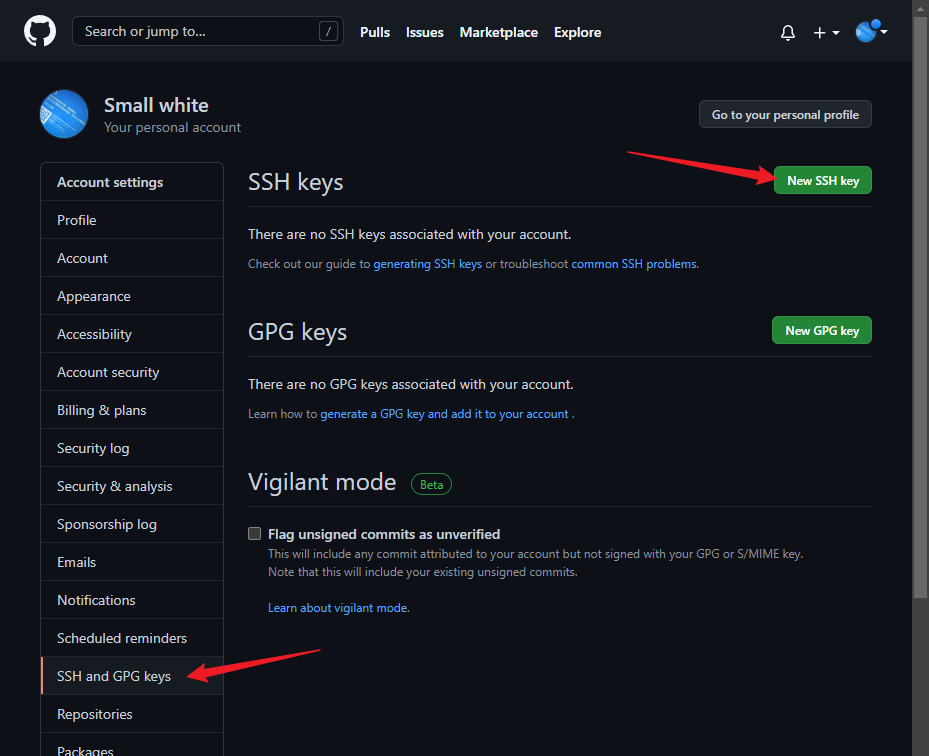

回到 Visual Studio Code，终端输入命令 `ssh -T git@github.com`，按回车后，输入 `yes` 测试是否成功（显示下图信息，则连接成功）：

终端继续输入如下命令，回车（`Github用户名` 输入你自己的用户名）：

`git config --global user.name "Github用户名"`

再输入（`Github注册邮箱` 输入你的注册邮箱），回车：

`git config --global user.email "Github注册邮箱"`

然后输入 `git config --global -l` 看看配置情况：

## 安装 Node.js

官网 https://nodejs.org/en/download/ 下载 Node.js，双击安装一路默认安装完成即可。

安装完成后，回到 Visual Studio Code 终端，输入命令 `node -v` 查看是否安装成功（显示 node 版本号即安装成功）：

## 安装 Hexo

所有必备的应用程序安装完成后，即可使用 npm 安装 Hexo。输入如下命令等待安装完成即可：

`npm install -g hexo-cli`

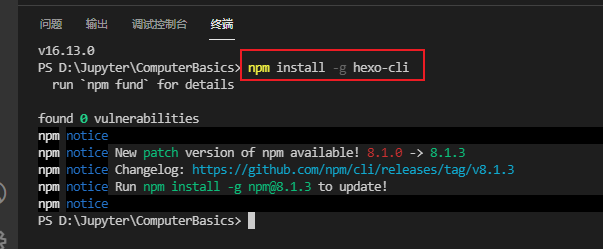

输入命令 `hexo -v` 查看是否安装成功：

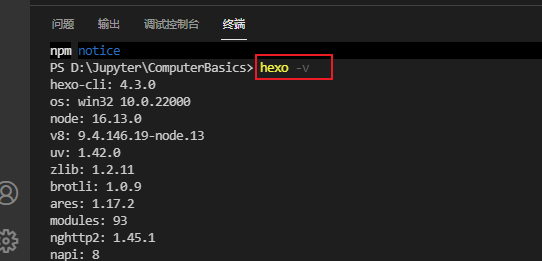

## 本地建站并预览

新建一个本地站点文件夹（下面示例建在 D 盘下，文件夹名为 blog）。

输入命令 `hexo init D:\blog`，回车：

文件夹建完后，Visual Studio Code 打开它：

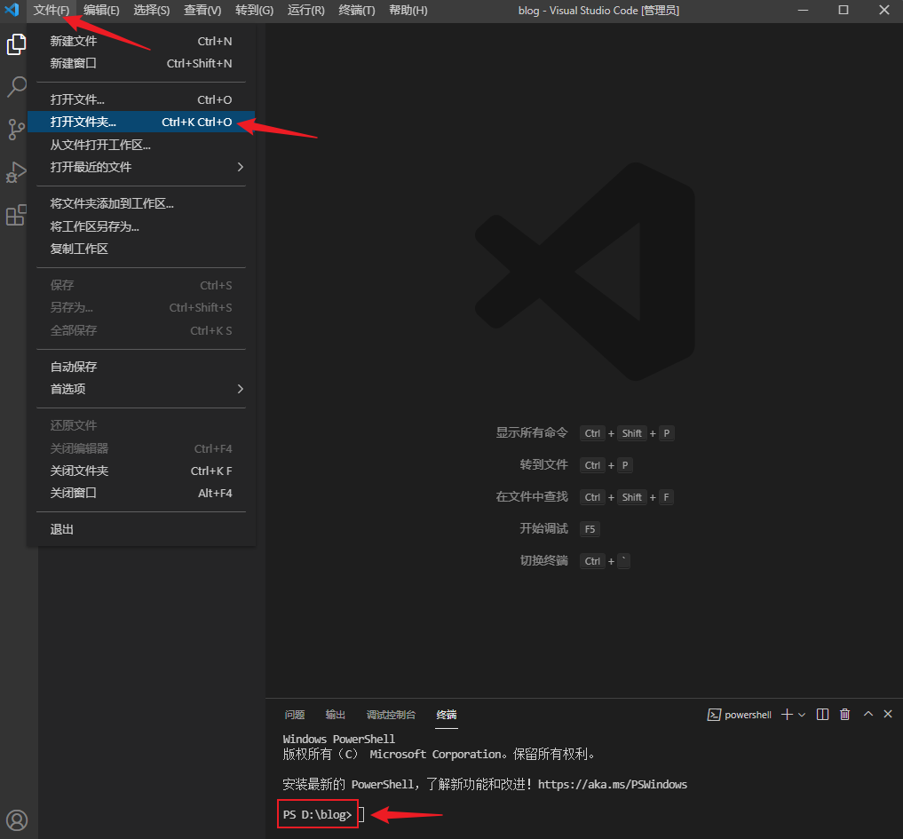

`npm install` 命令完成建站。

命令 `hexo g` 生成静态网页：

命令 `hexo s` 本地预览（`Ctrl + C` 停止预览），按住 Ctrl，终端单击显示的网址： http://localhost:4000 。

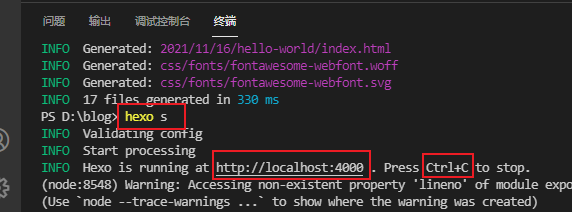

浏览器中打开的页面如下（这是 Hexo 自带的一个页面，后面介绍自己写博客）：

## 部署到 GitHub

新建一个 GitHub 仓库，仓库名格式 `GitHub用户名.github.io`，勾选 `Add a README file`，记住分支名（后面会用，一般是 main）：

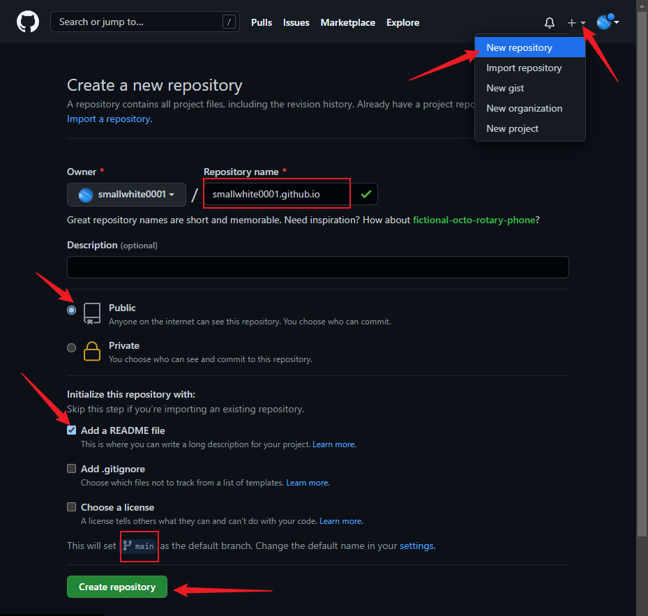

新建完成，回到终端，输入 `npm install hexo-deployer-git --save` 命令，安装部署工具。

打开站点文件夹（blog）下的 `_config.yml` 文件，拉到最底端，配置如下信息（repository 格式为：

`git@github.com:GitHub用户名/GitHub用户名.github.io.git`

其中 `GitHub用户名` 改为自己的，分支填写上面记住的 main）：

输入命令 `hexo d`，将本地站点部署到 GitHub：

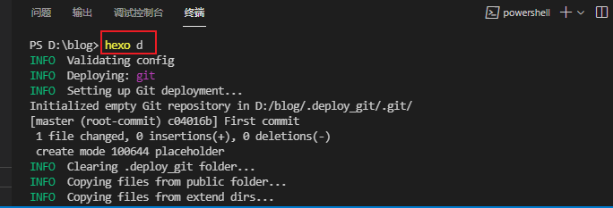

然后就可以通过 https://smallwhite0001.github.io/ 访问网站啦：

## 开始写博客

配置网站信息：打开站点文件夹（blog）下的 `_config.yml` 文件，配置网站标题，作者等信息：

更多配置查看 Hexo 官网：https://hexo.io/zh-cn/docs/configuration 。

还可以选择和配置自己喜欢的主题呢：https://hexo.io/themes/ ，尽情折腾吧。

新建博客：终端输入命令 `hexo new 'GitHub-build-personal-blog'`，将在 `blog\source\_posts\` 目录下生成一个 `GitHub-build-personal-blog.md` 的 markdown 文件：

打开 markdown 文件，开始写你的博客吧：

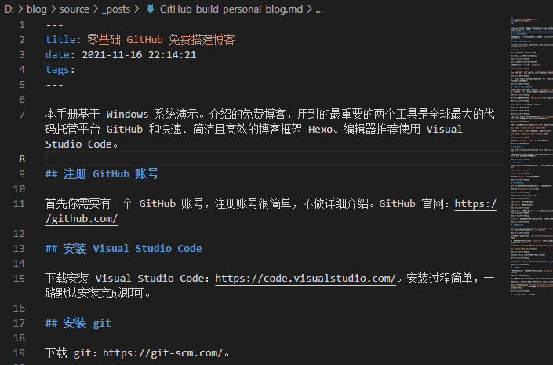

写完后，`Ctrl + S` 保存，输入命令 `hexo clean` 清除缓存，`hexo g` 重新生成，`hexo d` 再次部署，完成后清除浏览器缓存，再次访问 https://smallwhite0001.github.io/ 看看你新写的博客：

想要一篇文章，只显示前面的一部分内容，则在每一篇文章中加入 `<!--more-->`，该标记之后的文字需要点击 `Read More` 才展开：

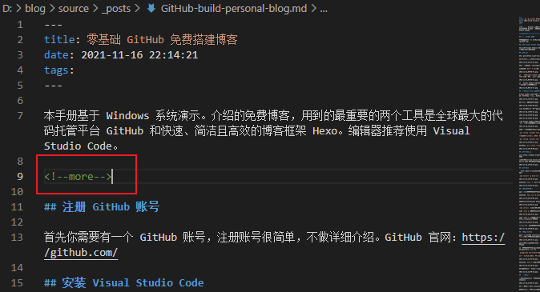

再依次执行 `hexo clean`，`hexo g`，`hexo d`，完成后清除浏览器缓存，再次访问 https://smallwhite0001.github.io/

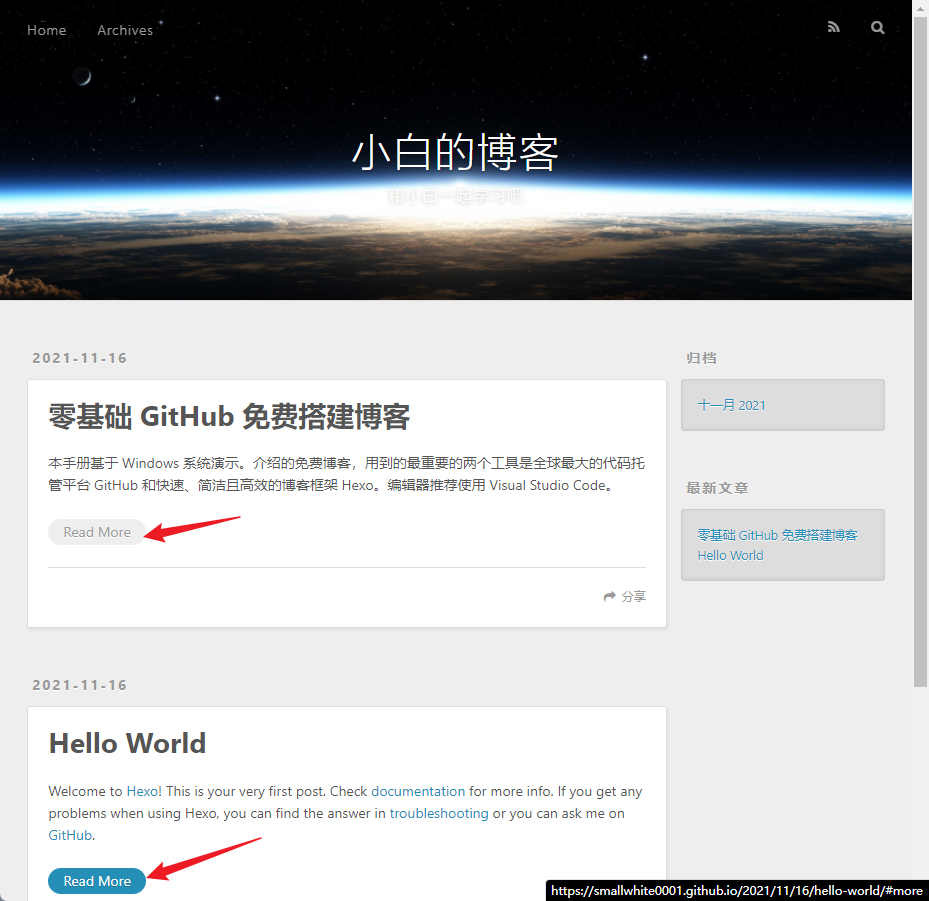

更多美丽新世界，留给您自己去探索了。